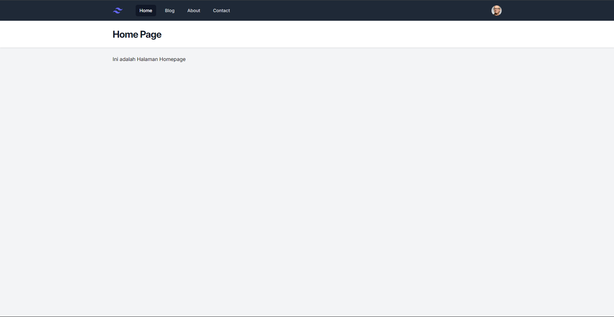

# Assignment Progress

---

|               Nama               |    NRP     |
| :------------------------------: | :--------: |
| Ranto Bastara Hamonangan Sitorus | 5025221228 |

## Tech yang digunakan

-   Laravel 11.x
-   MySQL
-   Tailwind UI

## Progress

### Minggu 2

Pada Minggu ke-2 ini kita belajar mengenai installasi Laravel dan pengenalan Laravel dasar seperti Struktur Folder, Laravel Blade, dan Laravel Blade Component

#### UI Updates

1. **Layout**
   
   **Berikut adalah contoh layout yang dipakai oleh semua page dalam web ini, komponen yang menyusun layout ini diantaranya:**

-   **navigation Bar:**Komponen ini berfungsi untuk mempermudah kita untuk berpindah page dan sebagai penanda bahwa kita di page apa, karena ketika kita berada di page Home maka tombol dengan label Home akan menyala.
-   **Title:**Komponen ini sebagai tempat untuk kita memberikan judul pada page yang kita buat, dan judul pada setiap page bisa dibuat berbeda.
-   **Body:**Komponen ini berfungsi sebagai tempat untuk kita memberikan isi dari page yang telah dibuat.

2. **HomePage**
   
   Dalam page Home kita memiliki title dengan tulisan "Home Page" dan body dengan isi paragraf "Ini adalaha halaman Homepage"
3. **Blog/Posts Page**
   
   Pada page ini terdapat title dengan tulisan "Blog" dan pada body page terdapat 3 post dengan judul, author, dan content yang berbeda
4. **About Page**
   
   Pada page ini terdapat title dengan tulisan "About" dan body yang berisi paragraf "Ini adalah Halaman About"
5. **Contact Page**
   
   Pada halaman ini terdapat title dengan tulisan "Contact" dan pada body terdapat paragraf "Ini adalah Halaman Contact"

### Minggu 3

Pada Minggu ke-3 ini kita belajar mengenai View Data dan Model, dimana kita akan membuat model untuk data Post yang akan ditampilkan melalui view posts (multipost), dan post (singlepost)

#### UI Updates

1. **Blog/Posts Page**
   
   Pada Halaman ini sebenarnya tidak ada perubahan yang signifikan dalam bagian UI namun ketika "Read More" ditekan dia akan menuju page post yang berisi isi post lebih detail
2. **Post Page**
   
   Halaman ini merupakan isi dari salah satu post yang berada di halaman posts page, di bagian body artikelnya tidak akan dilimit sehingga teks yang muncul merupakan teks secara keseluruhan.

### Minggu 4

Pada Minggu ke-4 ini kita belajar mengenai Database & migrasinya, dan kita juga belajar mengenai Eloquent ORM yang memudahkan kita untuk melakukan perubahan pada database.

#### UI Updates

**_Minggu ini tidak ada update UI, karena materi termasuk dalam bagian backend_**
